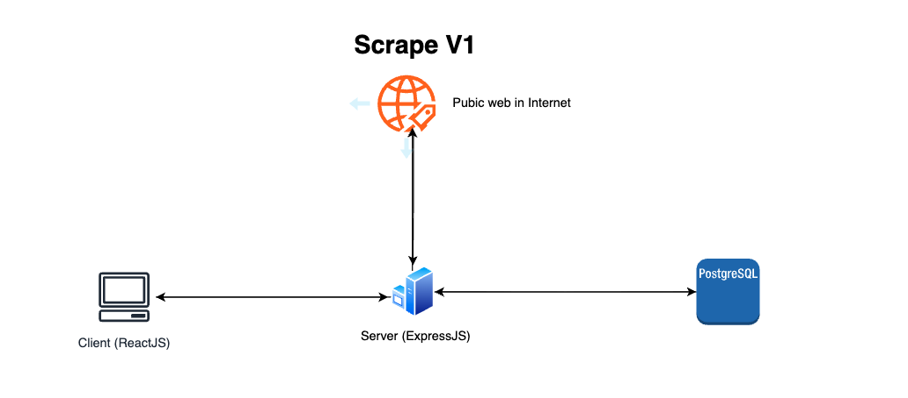
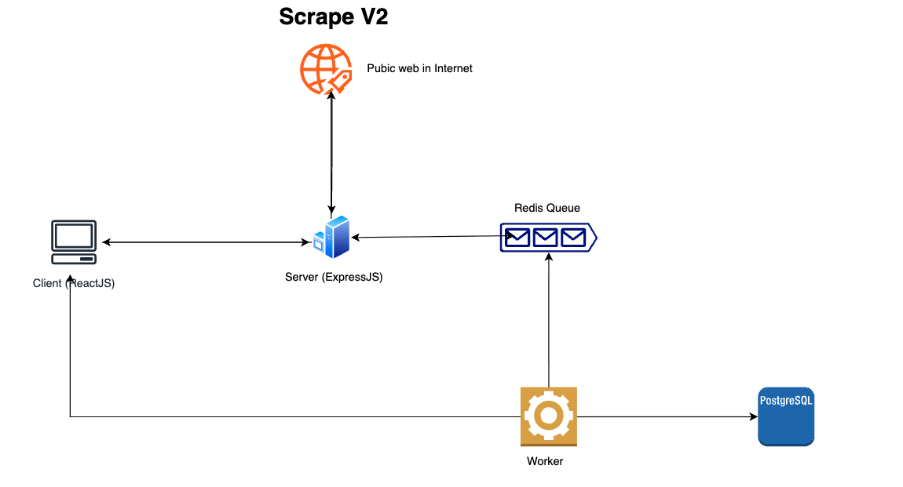

# Web Scraper API

A high-performance Express.js API for scraping images and videos from web URLs with caching, queue management, and load balancing capabilities.

## Architecture Overview
### Scrape V1 - Synchronous Architecture


### Scrape V2 - Asynchronous Architecture  


**Key Components:**
- **Express.js API**: RESTful endpoints with authentication
- **PostgreSQL**: Persistent storage for scraped data
- **Redis**: Caching layer and job queue management
- **BullMQ**: Background job processing for async scraping
- **Cheerio**: HTML parsing and content extraction

## Prerequisites

- **Node.js** 18+ 
- **Docker** & **Docker Compose** (for containerized setup)
- **PostgreSQL** 15+ (for local development)
- **Redis** 7+ (for local development)

## Quick Start

### Using Docker Compose (Recommended)

```bash
# Clone and start all services
git clone <repository-url>
cd momos-assignment
docker-compose up --build

# The API will be available at http://localhost:3000
```

### Local Development

```bash
# Install dependencies
npm install

# Start PostgreSQL and Redis (using Docker)
docker-compose up postgres redis -d

# Run database migrations
npm run migration:run

# Start development server
npm run dev

# The API will be available at http://localhost:3000
```

## Project Structure

```
src/
├── config/           # Application configuration
├── controllers/      # Request handlers
│   ├── assetsController.ts
│   ├── healthController.ts
│   ├── pagesController.ts
│   ├── scrapeController.ts
│   └── scrapeV2Controller.ts
├── database/         # Database setup and entities
│   ├── entities/
│   └── migrations/
├── middleware/       # Express middleware
├── routes/          # API route definitions
├── services/        # Business logic
│   ├── databaseService.ts
│   ├── queueService.ts
│   └── scrapingService.ts
├── types/           # TypeScript type definitions
├── utils/           # Utility functions
└── validators/      # Request/response validation
```

## API Documentation

### Base URL
```
http://localhost:3000/api
```

### Authentication
All endpoints require Basic Authentication:
- Username: `admin` (default)
- Password: `password` (default)

### Endpoints

#### Health Check
```http
GET /api/health
```
Returns API status and system information.

#### Scrape Assets (Synchronous)
```http
POST /api/scrape
Content-Type: application/json
Authorization: Basic <base64-encoded-credentials>

{
  "urls": ["https://example.com", "https://another-site.com"]
}
```

**Response:**
```json
{
  "success": true,
  "results": [
    {
      "url": "https://example.com",
      "assets": [
        {
          "type": "image",
          "url": "https://example.com/image.jpg",
          "alt": "Image description"
        }
      ],
      "cached": false
    }
  ],
  "cacheStats": {
    "totalRequests": 2,
    "cachedRequests": 0,
    "freshRequests": 2,
    "cacheHitRate": 0
  }
}
```

#### Scrape Assets (Asynchronous)
```http
POST /api/scrape/v2
Content-Type: application/json
Authorization: Basic <base64-encoded-credentials>

{
  "urls": ["https://example.com"]
}
```

**Response:**
```json
{
  "success": true,
  "message": "Scraping job queued successfully",
  "data": {
    "jobId": "job_123",
    "status": "waiting",
    "urls": ["https://example.com"]
  }
}
```

#### Get Job Status
```http
GET /api/scrape/v2/status/{jobId}
Authorization: Basic <base64-encoded-credentials>
```

#### Get All Assets
```http
GET /api/assets?page=1&limit=10
Authorization: Basic <base64-encoded-credentials>
```

#### Get All Pages
```http
GET /api/pages?page=1&limit=10
Authorization: Basic <base64-encoded-credentials>
```

## Load Testing

### Running Load Tests

```bash
# Test synchronous scraping (1000 requests, 50 concurrent)
node loadtest-v1.js

# Test asynchronous scraping with queue
node loadtest-v2.js
```

### Load Test Results

The load tests will output comprehensive metrics including:
- **Performance**: Requests/sec, latency statistics
- **Success Rate**: 2xx vs error responses
- **Latency**: P50, P90, P95, P99 percentiles
- **Throughput**: Data transfer rates
- **Performance Grade**: A-C rating based on latency

### Expected Performance
- **Target**: 1000+ requests/sec
- **Latency**: <500ms average
- **Success Rate**: >95%
- **Concurrent Users**: 50+ simultaneous connections

### Load Test Configuration

```javascript
// loadtest-v1.js configuration
{
  amount: 1000,        // Total requests
  connections: 50,      // Concurrent connections
  pipelining: 1,        // HTTP pipelining
  timeout: 30000        // Request timeout (ms)
}
```

---

**Environment Variables:**
- `DB_HOST`, `DB_PORT`, `DB_USERNAME`, `DB_PASSWORD`, `DB_NAME`
- `REDIS_HOST`, `REDIS_PORT`, `REDIS_PASSWORD`
- `AUTH_USERNAME`, `AUTH_PASSWORD`
- `SCRAPING_TIMEOUT`, `MAX_URLS`, `CACHE_VALIDITY_DAYS`
- `QUEUE_CONCURRENCY`, `CORS_ORIGIN`
